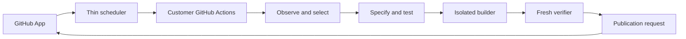

# Architecture

Daily Improver is a portable, language-neutral improvement engine. PHP/Laravel is its first proving adapter. GitHub Actions is an execution substrate, and a GitHub App-backed control plane supplies scheduling, installation state, short-lived credentials, metering, feedback, and PR creation.

The control plane does not clone repositories, install dependencies, run tests, or retain source code. Repository execution remains on GitHub-hosted or customer-controlled runners.

## Trust boundaries

- Analysis has read-only repository access and produces evidence plus one selected candidate.
- Test generation receives the approved candidate and emits tests plus an HMAC integrity manifest.
- The builder receives the repository, immutable tests, the spec, and a file allowlist. It has no access to earlier stage credentials.
- Verification starts from a fresh checkout, validates the manifest and diff, and executes repository-owned verification commands.
- Publication emits a request. The GitHub App, not the workflow token, opens the draft PR.

The model-facing agent protocol uses separate, fail-closed `test-agent-request/v1` / `test-agent-response/v1` and `builder-request/v1` / `builder-response/v1` contracts. Every field is explicit and bounded; unknown fields, unsupported versions, absolute or traversing paths, oversized collections, malformed commands, and invalid usage values are rejected.

Only these approved inputs cross the test-agent boundary: the semantic task and limits, bounded evidence and invariants, language/framework identifiers, explicit test commands, test conventions, and repository-relative paths where tests may be written. The request does not contain a host repository path or credentials. Its response identifies the generated tests and changed files, summarizes the work, and records bounded provider/model usage.

Before either agent stage, specification deterministically derives or validates an exact `improvement-intent/v1` contract. The exhaustive language-neutral intents are `defect`, `refactor`, `performance`, and `maintainability`, paired respectively with `defect-regression`, `refactor-characterization`, `performance-measurement`, and `maintainability-quality` baseline proof modes. Candidate categories provide exhaustive defaults, while adapters may declare more precise bounded semantics. Missing, malformed, extended, unsupported, or intent/proof-inconsistent contracts fail closed. The contract crosses the structured test and builder requests and is retained in the sealed specification and `test-plan/v7` artifact.

The local proving loop requires a defect regression to fail for a credible behavioral reason against the baseline; syntax, resource, dependency, and autoload failures remain invalid proof. Refactor characterization, performance measurement, and maintainability quality baselines must pass before the builder runs. Independent post-change verification must pass for every intent, so a passing baseline alone never authorizes publication.

When a specification contains property invariants, it must also retain one evidence-backed repository-relative production target. Immediately before running the generated test, the trusted runner creates a fresh execution nonce and an empty runner-owned proof path. The executed test must emit an exact `property-test-execution-proof/v1` artifact containing that nonce, an observed changed test path, the selected target, one exact approved invariant, 32–1,000 unique SHA-256 input digests, and matching target-execution and invariant-check counts. Defect baselines must report at least one failed check; passing baseline modes must report none. Missing, malformed, stale-nonce, trivial, duplicate-input, unexecuted, wrong-test, wrong-target, wrong-invariant, or inconsistent proofs fail before artifact sealing and builder invocation. The validated proof and its `test-plan/v7` reference are sealed from the builder.

The trusted runner also compares the observed generated property test with its selected production target before the builder. The language-neutral inspection strips comments and string contents, tokenizes both bounded regular files, and detects direct production-source reading, long exact token copies, and long identifier-normalized structural copies. Its exact `test-implementation-inspection/v1` decision is bound to the observed test, selected target, and approved invariant or acceptance criterion. It retains only paths, SHA-256 source identities, bounded metrics, exhaustive signal names, and the accepted/rejected outcome—never source text. Strong restatement signals fail before builder invocation; ordinary black-box calls and assertions remain valid. The decision and its `test-plan/v7` reference are sealed from the builder.

Every generated test must also emit an exact nonce-bound `generated-test-lifecycle-report/v1` during three bounded baseline executions and three post-change executions. The language-neutral report binds every observed generated test path to an exhaustive executed, skipped, or disabled status, an assertion count, and a SHA-256 identity of its effective tolerance contract. The trusted runner rejects absent, skipped, disabled, assertion-free, deleted, changed, or observably weakened tests. Varying command outcomes or execution metrics produce `candidate-quarantine/v1`, release the daily claim, and stop before the builder at baseline or before publication after the change. Accepted baseline and verification decisions retain only bounded commands, exit codes, durations, file identities, assertion/tolerance metrics, and stdout/stderr hashes; raw command output is never retained. Baseline lifecycle evidence is sealed from the builder through `test-plan/v7` and the manifest.

After an accepted baseline lifecycle, the core may ask the selected repository adapter for framework-specific generated-test evidence. The PHP adapter implements exact `pest-generated-test-quality-inspection/v1` and `phpunit-generated-test-quality-inspection/v1` evidence only when the matching framework is detected. It inspects every bounded generated PHP test and binds the deterministically selected test plus every file hash and assertion count to the baseline lifecycle. Pest inspection rejects focused discovery, `skip`/`todo` markers, assertion-free declarations, empty providers, and dynamic or named providers whose case coverage cannot be proven locally. PHPUnit inspection recognizes convention-, attribute-, and docblock-discovered public methods only inside `TestCase` subclasses; it rejects skipped/incomplete markers, per-method assertion gaps, empty providers, external providers, and named or inline providers whose cases cannot be proven locally. Malformed lexical structure, non-regular or oversized files, unsupported discovery syntax, extended evidence, and mismatched paths, hashes, attempts, or metrics fail before the builder. Accepted evidence retains only paths, SHA-256 identities, bounded counts, exhaustive signals, and the framework/schema identity; source text is not retained. The generic core does not encode PHP test syntax.

When the PHP profile also detects `giorgiosironi/eris`, the adapter runs the ordinary Pest or PHPUnit gate first and then emits exact `eris-property-test-quality-inspection/v1` evidence. The Eris decision is bound to the accepted three-attempt lifecycle and the already-validated property execution proof, selected test, production target, approved invariant, and 32–1,000 observed input executions. The selected property test must use `Eris\TestTrait`, supported static `Eris\Generators` factories, and a direct `forAll(...)->then(...)` execution with a selected-target invocation and explicit invariant assertion inside the property body. Dynamic or unknown generators, missing or bypassed execution, source-level iteration overrides, absent target calls or assertions, malformed or oversized inputs, and inconsistent exact evidence fail before the builder. Retained evidence contains bounded semantic inputs, paths, hashes, metrics, and exhaustive signals without generated source text; PHP syntax remains outside the core.

Evidence may explicitly declare that the selected baseline target embodies one bounded known mutation through `known-mutation/v1`. The requirement names only a bounded mutation identity and operator, the selected production target, the `baseline-known-mutant` execution mode, and one exact approved property invariant or acceptance criterion. It contains no source body. When applicable, the trusted runner requires the relevant observed generated test to fail that criterion, then creates `known-mutation-execution-proof/v1` from the actual command result before sealing or builder invocation. The proof retains the exact bounded command, test, target, criterion, exit code, behavioral classification, duration, and SHA-256 output hashes, but neither raw source nor command output. Missing, malformed, unexecuted, survived, wrong-test, wrong-target, wrong-criterion, and non-behavioral results fail closed. Candidates without explicit applicable mutation evidence do not manufacture a mutation.

Only these approved inputs cross the builder boundary: the same semantic task and limits, language/framework identifiers, the production-file allowlist, immutable protected-file identities, explicit verification commands, and builder conventions. The builder receives no test-agent credentials. Its response identifies changed files, supplies bounded implementation notes, and records bounded provider/model usage.

The local command-backed provider also treats the process environment as a stage boundary. The CLI derives one exact runner-owned runtime environment containing only a validated absolute `PATH`; agent commands execute through a non-login shell with that runtime plus the exact current `DAILY_IMPROVER_AGENT_STAGE` and repository-contained `DAILY_IMPROVER_SPEC_PATH`. The provider does not inherit test, analysis, manifest, control-plane, GitHub, model, or other ambient variables. Missing, relative, empty-component, oversized, extended, or NUL-containing runtime environments and escaped specification paths fail before command execution. The production structured provider remains a separate in-memory transport boundary and continues to acquire only the short-lived credential for its current stage.

Command-backed builders also default to exact runner-owned `builder-network-policy/v1` denial. The policy is constructor input at the process boundary and is never loaded from the checkout, specification, repository configuration, command, or model output. On macOS, the runner wraps the disposable builder with a deny-network sandbox profile; on Linux, it creates a fresh user and network namespace. Immediately before every denied builder command, the runner opens a loopback listener, proves it is reachable without isolation, and requires the isolated probe to fail to connect. Missing, unsupported, ineffective, or unavailable isolation stops before the builder command. An exact trusted policy may explicitly approve outbound access; repository content cannot request that exception. Runner-owned model endpoint and credential exchanges remain outside this command-execution sandbox.

Dependency installation is a separate fail-closed command boundary rather than an assumption derived from network denial. Command-backed builders default to exact runner-owned `builder-dependency-installation-policy/v1` denial. The runner prepends a temporary executable layer that rejects the known package-manager entry points for PHP, JavaScript, Python, Ruby, Rust, Go, JVM, and .NET ecosystems before the real executable runs. It rejects configured absolute or relative package-manager paths and command-level `PATH` replacement, while PATH-resolved calls made indirectly by a child shell still meet the same rejecting entry point. Because package-manager aliases and scripts may install indirectly, denied mode blocks the entry point rather than trusting a subcommand allowlist. Only an exact constructor policy may approve execution; checkout configuration, specifications, commands, model output, and the independent network policy cannot grant approval.

Every command-backed builder also requires an exact runner-owned `builder-resource-limits/v1` contract before execution. It independently bounds CPU time, aggregate resident memory, repository disk growth, combined retained stdout/stderr, and wall-clock duration. Unix hard CPU and file-size limits complement frequent process-group memory/CPU and repository accounting. The runner launches the builder in a fresh process group, terminates the entire group on exhaustion or when its leader exits, escalates to `SIGKILL`, and retains at most the approved combined output bytes. Exhaustion is classified only as `cpu`, `memory`, `disk`, `output`, or `wall-clock` without copying builder output into the failure. Missing, malformed, extended, unsupported-platform, or out-of-bounds resource decisions fail before the builder command. The contract is supplied at the runner construction boundary and cannot be weakened by checkout configuration, specifications, commands, or model output.

Specification removes repository-protected scopes before producing the builder allowlist. Immediately before invocation, the runner derives exact production-file permissions only from that validated specification and rejects empty, duplicate, excessive, absolute, traversing, wildcard, protected, non-regular, symlink-crossing, or multiply hard-linked paths. The same boundary derives `builder-protected-inputs/v1` only from runner-trusted protected patterns and sealed test-manifest identities. It rejects missing, mutable, replaced, non-regular, symlink-crossing, or multiply hard-linked inputs, hashes trusted configuration matches, and gives sealed identities precedence. Tests, specifications, policies, workflows, migrations, and their parent directories are materialized read-only in the disposable builder copy and remain readable to the builder. The runner snapshots device/inode identities for the disposable root and every allowlisted parent chain, rejects builder-created links and parent replacements, copies an opened single-link regular file into trusted staging, and binds the staged bytes to their identity and SHA-256 digest. Protected inputs, the disposable target and parent chain, the unchanged source-checkout target and parent chain, and the trusted staged file are revalidated immediately before each atomic import. The copy contains no Git metadata. Only approved regular-file writes or deletions are atomically imported into the isolated run checkout; response validation, sealed manifests, diff limits, semantic inspection, and independent verification remain additional fail-closed gates rather than substitutes for this execution boundary.

`StructuredModelAgentProvider` constructs and re-validates each versioned request before invoking an injected model transport. The transport receives the host working directory as execution context, but that path is not serialized into the model request. Responses are parsed fail-closed, and every response-declared path must match the stage allowlist; builder claims must also avoid protected paths. Validated provider, model, token, latency, and cost usage is stored in versioned usage artifacts. Model summaries, generated-test descriptions, and implementation notes are stored in separate artifacts marked `untrusted-model-output`; test-stage artifacts are sealed before the builder runs.

Structured transports also require explicit test-stage, builder-stage, and aggregate daily cost budgets. An injectable deterministic ledger reserves every attempt before transport against the stage limit, remaining daily budget, and the specification's unchanged aggregate cost ceiling. The approved reservation is exposed to the transport as its maximum cost. Validated actual usage replaces the reservation after a response; attempts without validated usage consume the reservation conservatively, and usage above the reservation fails closed.

Transport failures use an explicit bounded classification. Only `transient` failures can retry, with at most five attempts and injected deterministic delay timing. `permanent`, `malformed-response`, `policy`, and `budget` classifications stop immediately. The trusted `agent-usage/v3` artifact includes `model-request-attempts/v1` metadata and a `model-cost-budget-decision/v2` decision for every recorded attempt; transport messages never enter this evidence. Model rationale remains separate and untrusted.

Every structured transport attempt also acquires an ephemeral `model-stage-credential/v1` value from an injected source. The credential must match the exact test or builder stage and the current repository/specification scope, already be valid, remain unexpired, and have a lifetime of at most fifteen minutes. Missing, malformed, future-issued, expired, overlong, wrong-stage, or wrong-scope credentials fail as policy violations before transport with zero model cost. The provider keeps only an in-memory hash to prevent the same secret crossing from test to build. The raw secret is passed only in transport context: it is never included in the model request, response, usage/rationale artifact, attempt metadata, or failure message.

`TrustedRunnerModelStageCredentialSource` is the production credential-exchange boundary. An injected resolver supplies the HTTPS exchange locator plus the exact trusted issuer and audience without accepting repository input, and a separate injected identity source supplies an exact `trusted-runner-identity/v1` assertion bound to that issuer, audience, requested stage, and hashed repository/specification scope. Only non-secret bounded claims enter the versioned exchange body; the assertion exists only in its authorization header. The exchange response must be an exact `model-stage-credential/v1` for the same stage and scope with at most a fifteen-minute lifetime. Configuration, identity, request, response, protocol, timeout, and size validation fail closed. Connection, timeout, retryable HTTP status, permanent status, and malformed response outcomes retain only an explicit sanitized classification; only the transient class can use the provider's bounded retry policy, and a failed exchange settles zero model cost.

`createTrustedRunnerStructuredProvider` is the production customer-runner composition boundary. It accepts one exact `trusted-runner-structured-provider-configuration/v1` value for budgets, retry policy, routing, and opaque endpoint policy, plus runner-owned endpoint resolution, identity acquisition, credential-exchange resolution, clock, HTTPS, budget-state, and retry-timing dependencies. It constructs the credential source, production HTTPS transport, and structured provider without reading the target repository or its `.ai` configuration. Missing, extended, unsupported, malformed, cross-stage, cross-scope, and cross-endpoint inputs fail before a model call. The local CLI remains separately composed with `CommandAgentProvider`.

The opt-in MoneyAllocator live proof keeps the endpoint and exchange policy outside the checkout and requires an explicit runner invocation mode. Because the HTTPS protocol does not serialize a host checkout path or repository source, its real structured endpoint is a customer-runner agent endpoint bound out-of-band to the dedicated proof workspace. The endpoint materializes response-declared changes there; the core then proves the generated test fails on the committed baseline, seals protected artifacts, and independently verifies the bounded builder patch. This live proof is not part of the deterministic checkpoint suite.

`OpenAiResponsesAgentProvider` is a narrower developer-only real-model proof, not the production trusted-runner composition. It calls the Responses API from the isolated worktree, supplies only bounded allowlisted source context without a host path, omits protected generated-test inputs from builder context, obtains strict structured complete-file replacements, and validates all writes locally before the established test sealing and verification boundaries run. Trusted runner requirements make the actual harness loading contract explicit. The core rejects defect baselines classified as syntax, resource-limit, dependency, or autoload failures so a broken generated test cannot masquerade as behavioral proof. Its API key stays in the direct client boundary and is not stage-scoped, so this proof does not satisfy the production short-lived credential or customer endpoint requirements and remains opt-in outside deterministic checkpoints. The complete MoneyAllocator test-agent, baseline, builder, sealing, verification, and draft-publication path passed with a real OpenAI model on 2026-07-17.

The committed replay fixtures exercise the test and builder protocols without repository access, a live model endpoint, or permanent credentials. They replay through the injected transport, credential clock and source, retry timing, and cost ledger. A transient builder failure proves conservative reservation accounting and retry sanitization: transport error text is fixture input only and cannot enter the trusted or untrusted provider result.

Before any structured transport attempt, the provider produces a language-neutral `task-complexity-decision/v1` from the already validated request. The decision considers only bounded task limits and collection counts: file scope above two and changed-line scope above 100 contribute two points each; more than four acceptance criteria, two property invariants, or four evidence items contribute one point each. A score of two or more selects `higher`; otherwise it selects `lower`. It does not inspect task prose, repository source, host paths, credentials, or model rationale. An exact-schema `model-routing-policy/v1` supplies unique bounded route IDs plus explicit provider/model targets for both complexity levels and both stages. Incomplete policies, unsupported versions, duplicate route IDs, or identical lower/higher targets for one stage fail closed. The chosen route is passed to every attempt, response usage must name that target, and the trusted `agent-usage/v4` artifact retains the decision beside the unchanged credential, retry, and cost gates.

Every configured route is also assigned exactly once by an exact-schema `model-endpoint-policy/v1`. An endpoint exposes only a bounded identifier and endpoint-neutral capabilities: the structured-agent protocol version, supported test/build stages, ephemeral-credential authentication, and maximum-cost enforcement. The policy must cover all four routed targets, and a route may be assigned only to an endpoint that supports its stage. Incomplete, extended, unsupported, duplicate, or route-incompatible configuration fails during provider construction, before reservation, credential acquisition, or transport. The selected endpoint metadata crosses only the injected transport boundary; endpoint resolution remains transport-owned, so provider-specific URLs and behavior do not enter core stage requests or routing contracts. Authentication remains a separate ephemeral transport-context value and cannot enter endpoint metadata, requests, usage, routing decisions, rationale, attempts, or sanitized failures.

`HttpsStructuredEndpointTransport` is the production implementation of that boundary. It passes only the opaque endpoint ID to an injected trusted runner resolver, validates an exact `model-endpoint-resolution/v1`, and rejects mismatched IDs, non-HTTPS locators, embedded URL credentials, fragments, extended configuration, and unbounded timeouts or body limits before connecting. Its versioned HTTPS body contains the already validated stage request, selected route, and reserved maximum cost; the ephemeral credential exists only in the authorization header. Requests and responses are capped at 1 MiB, timeouts at two minutes, redirects and unsuccessful statuses fail closed, and only connection/timeout plus HTTP 408, 425, 429, and 5xx failures are transient. Oversized, non-JSON, or invalid-JSON responses are classified as malformed without retaining response bodies, headers, credentials, locators, or underlying error text.

Committed `structured-provider-replay/v3` fixtures bind both routed stages to a deterministic private endpoint and retain the same request/response validation, route selection, short-lived credential, retry, and budget boundaries without network access or permanent credentials.

GitHub OIDC is exchanged for short-lived, stage-scoped control-plane credentials. The workflow token only needs repository-local permissions appropriate to its job. The setup workflow is introduced through a human-reviewed setup PR; the App does not request workflow-write permission.

## Extension model

`RepositoryAdapter` detects an ecosystem, constructs capabilities, discovers evidence-backed candidates, and classifies failures. Framework adapters will decorate language profiles. Core ranking, policy, specifications, history, isolation, verification, and publishing stay language-neutral.

The next adapters should be TypeScript and Python, but only after the PHP/Laravel loop consistently yields mergeable PRs.

## Local proving loop

`daily-improver run` is the Phase 1 vertical slice. It reads evidence, selects exactly one candidate, creates an isolated Git worktree and daily branch, delegates tests and implementation through separate `AgentProvider` calls, enforces the selected intent's baseline proof, seals tests/specification artifacts, runs independent verification, commits the verified result, and emits the draft-PR request.

Verification combines repository commands with structural gates: protected-test hashes, file allowlists, diff limits, protected paths, property-test non-triviality, static-analysis suppression detection, broad exception-swallowing detection, and public API addition detection. These heuristics supplement ecosystem tools; they do not replace PHPStan, PHPUnit/Pest, or Infection.

Performance observation invokes manifest-detected PHPUnit/Pest executables directly and writes JUnit timing output to a trusted temporary path. Laravel query timing is an explicit opt-in test-listener contract: the repository may write a versioned report only to an injected temporary path, but the adapter treats its contents as untrusted. Report size, count, duration, source paths, schema, and thresholds are bounded; SQL is normalized transiently into a fingerprint, and the raw report is removed before normalized evidence crosses the observer boundary.

Duplicate-code observation invokes manifest-detected or explicitly configured PHPCPD directly and writes PMD CPD XML to a trusted temporary path. Only bounded repository-relative regions, line ranges, token/line counts, exact-match similarity, generated messages, and tool/configuration provenance cross the observer boundary. Duplicated code fragments in the report remain transient and are removed with the raw artifact.

Before deduplication or ranking, the language-neutral core requires non-empty bounded evidence and a valid `candidate-reproducibility/v1` contract. The contract explicitly declares reproducibility, strength, and bounded provenance; absent, non-reproducible, malformed, or unbounded inputs are rejected, and analysis fails closed when none remain.

The core then deduplicates candidates that declare the same versioned subsystem and defect identity. The strongest reproducible candidate is retained as a whole, including its evidence, provenance, target, and explanation; deterministic tie-breaks make the result independent of collector order. Different defect identities remain separate even when they point at the same file or package. Candidates without a semantic identity are deduplicated only by their stable candidate ID.

Ranking uses an exhaustive language-neutral weight table keyed by candidate kind. Every category rewards reproducible evidence strength, likely impact, confidence, and testability and penalizes estimated effort, estimated diff, change risk, and subsystem risk. Unit-interval factors and integer diff estimates bounded by a 10,000-line observation ceiling are mandatory and fail closed before deduplication when invalid. Repository `selection.priorities` entries must be unique members of the same exhaustive candidate-kind set. Their order adds at most `0.05` of deterministic influence to a valid category score; an empty list adds nothing, and priority cannot bypass evidence, size, value-classification, or other fail-closed gates. An optional versioned value classification can identify a candidate as cosmetic-only and cap its weighted score at `0.01`; malformed classifications fail closed. Category emphasis remains language-neutral: dependency vulnerabilities favor impact, static analysis and documentation favor confidence, and mutation testing applies the strongest effort penalty. Scores are rounded consistently and ties are resolved by stable candidate ID.

Every ranked candidate also produces an ordered `candidate-score-explanation/v1`. It contains only the bounded candidate reference and category, all eight normalized factors, the exhaustive signed category weights, their raw weighted contribution, repository-priority influence, an optional cosmetic-only cap, and the final rounded score. Replaying the record must exactly reproduce the candidate score and stable-ID tie order. Canonical weights and repository priorities are revalidated before specification; malformed, incomplete, unbounded, extended, or inconsistent explanations fail closed. Version 5 analysis artifacts and planning runs retain these explanations even when a ranked candidate is later scope-routed or suppressed, without retaining evidence, rationale, targets, provenance, or source paths in the explanation.

Ranked candidates are scope-gated against repository-owned autonomous file and changed-line limits before selection. A candidate exactly at both limits remains eligible. The pipeline selects the highest-ranked bounded candidate even when a higher-ranked oversized candidate exists. It emits at most one `human-task-recommendation/v1` for the highest-ranked oversized candidate; this generated artifact contains bounded identity, category, title, estimated counts, configured limits, and routing reason, but excludes evidence, rationale, targets, and source paths. When every credible candidate is oversized, the planning run is rejected without creating a specification, preserving the human-review trust boundary.

Every input removed before autonomous selection also produces one bounded `candidate-exclusion/v2` record at its first failed gate. The exhaustive reason set distinguishes malformed scope, evidence, scoring, semantic deduplication, oversized autonomous scope, and unresolved semantic finding matches. Records are sorted deterministically and retain only a bounded candidate reference, an optional valid category, the retained candidate reference for deduplication, and the finding hash for an unresolved match; invalid IDs become hashes. They never retain evidence, provenance, rationale, titles, targets, or source paths. The version 5 analysis artifact and persisted planning runs carry these records, including rejected runs where no candidate survives.

Before autonomous selection, analysis reads fresh `unresolved-finding-state/v1` through an injected source. The core has no network access. The state is bound to the SHA-256 of the independently supplied trusted repository scope, expires after fifteen minutes, and carries at most 1,000 unique SHA-256 finding identities. A candidate identity hashes its versioned semantic deduplication tuple and candidate kind, falling back to its kind plus stable bounded candidate ID when no semantic tuple exists. Matching candidates are excluded without retaining the tuple, evidence, or source paths, and the highest-ranked unmatched bounded candidate remains eligible. Missing, malformed, non-regular, oversized, stale, future-dated, or cross-repository state fails closed.

Specification is guarded by an atomic `daily-improvement-decision/v1` claim keyed by the SHA-256 identity of the canonical repository path and its UTC calendar date. The persisted claim is `active` while an improvement is planned and transitions to `completed` exactly once when a verified publication request is authorized. An existing active or completed claim fails closed before another specification is created. Candidate-only rejection and oversized human-task routing happen before the claim, while a policy-rejected specification releases it; neither consumes the repository day. Repository paths are not retained in the daily decision, and separate canonical repositories have independent claims.

Specification is also guarded by a fresh `open-pull-request-state/v1` input produced outside the core by the trusted control-plane/GitHub boundary. The core receives it through an injected source and performs no network access. The state is bound to the SHA-256 of an independently supplied trusted repository scope (such as a GitHub repository ID), contains only an observation timestamp and bounded non-negative integer count, and expires after fifteen minutes. This external scope keeps repositories distinct even when every container mounts its checkout at `/repo`. Missing scope or state, malformed or non-regular input, oversized, stale, future-dated, negative, fractional, unbounded, or cross-repository state fails closed. A count at or above repository-owned `limits.max_open_prs` rejects the plan before the daily claim or specification and produces `open-pull-request-limit-decision/v1`; candidate rejection and human-task routing occur before this state is read.

Laravel validation and error-handling observation uses a bounded, versioned adapter rule registry rather than model inference or repository-owned analysis scripts. The initial rules identify request data passed wholesale into mass-assignment APIs, empty catch blocks, and broad exception catches that return only a default value. The observer retains repository-relative file and line identity, rule identity, generated messages, rule-set provenance, and hashed Composer configuration; source excerpts remain inside the repository boundary.
