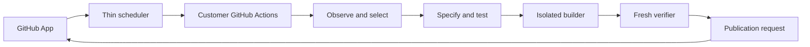

# Architecture

Daily Improver is a portable, language-neutral improvement engine. PHP/Laravel is its first proving adapter. GitHub Actions is an execution substrate, and a GitHub App-backed control plane supplies scheduling, installation state, short-lived credentials, metering, feedback, and PR creation.

The control plane does not clone repositories, install dependencies, run tests, or retain source code. Repository execution remains on GitHub-hosted or customer-controlled runners.

## Trust boundaries

- Analysis has read-only repository access and produces evidence plus one selected candidate.
- Test generation receives the approved candidate and emits tests plus an HMAC integrity manifest.
- The builder receives the repository, immutable tests, the spec, and a file allowlist. It has no access to earlier stage credentials.
- Verification starts from a fresh checkout, validates the manifest and diff, and executes repository-owned verification commands.
- Publication emits a request. The GitHub App, not the workflow token, opens the draft PR.

The model-facing agent protocol uses separate, fail-closed `test-agent-request/v1` / `test-agent-response/v1` and `builder-request/v1` / `builder-response/v1` contracts. Every field is explicit and bounded; unknown fields, unsupported versions, absolute or traversing paths, oversized collections, malformed commands, and invalid usage values are rejected.

Only these approved inputs cross the test-agent boundary: the semantic task and limits, bounded evidence and invariants, language/framework identifiers, explicit test commands, test conventions, and repository-relative paths where tests may be written. The request does not contain a host repository path or credentials. Its response identifies the generated tests and changed files, summarizes the work, and records bounded provider/model usage.

Only these approved inputs cross the builder boundary: the same semantic task and limits, language/framework identifiers, the production-file allowlist, immutable protected-file identities, explicit verification commands, and builder conventions. The builder receives no test-agent credentials. Its response identifies changed files, supplies bounded implementation notes, and records bounded provider/model usage. Filesystem access and response claims remain subject to the independent manifest, diff, and verification gates.

`StructuredModelAgentProvider` constructs and re-validates each versioned request before invoking an injected model transport. The transport receives the host working directory as execution context, but that path is not serialized into the model request. Responses are parsed fail-closed, and every response-declared path must match the stage allowlist; builder claims must also avoid protected paths. Validated provider, model, token, latency, and cost usage is stored in versioned usage artifacts. Model summaries, generated-test descriptions, and implementation notes are stored in separate artifacts marked `untrusted-model-output`; test-stage artifacts are sealed before the builder runs.

Structured transports also require explicit test-stage, builder-stage, and aggregate daily cost budgets. An injectable deterministic ledger reserves every attempt before transport against the stage limit, remaining daily budget, and the specification's unchanged aggregate cost ceiling. The approved reservation is exposed to the transport as its maximum cost. Validated actual usage replaces the reservation after a response; attempts without validated usage consume the reservation conservatively, and usage above the reservation fails closed.

Transport failures use an explicit bounded classification. Only `transient` failures can retry, with at most five attempts and injected deterministic delay timing. `permanent`, `malformed-response`, `policy`, and `budget` classifications stop immediately. The trusted `agent-usage/v3` artifact includes `model-request-attempts/v1` metadata and a `model-cost-budget-decision/v2` decision for every recorded attempt; transport messages never enter this evidence. Model rationale remains separate and untrusted.

Every structured transport attempt also acquires an ephemeral `model-stage-credential/v1` value from an injected source. The credential must match the exact test or builder stage and the current repository/specification scope, already be valid, remain unexpired, and have a lifetime of at most fifteen minutes. Missing, malformed, future-issued, expired, overlong, wrong-stage, or wrong-scope credentials fail as policy violations before transport with zero model cost. The provider keeps only an in-memory hash to prevent the same secret crossing from test to build. The raw secret is passed only in transport context: it is never included in the model request, response, usage/rationale artifact, attempt metadata, or failure message.

GitHub OIDC is exchanged for short-lived, stage-scoped control-plane credentials. The workflow token only needs repository-local permissions appropriate to its job. The setup workflow is introduced through a human-reviewed setup PR; the App does not request workflow-write permission.

## Extension model

`RepositoryAdapter` detects an ecosystem, constructs capabilities, discovers evidence-backed candidates, and classifies failures. Framework adapters will decorate language profiles. Core ranking, policy, specifications, history, isolation, verification, and publishing stay language-neutral.

The next adapters should be TypeScript and Python, but only after the PHP/Laravel loop consistently yields mergeable PRs.

## Local proving loop

`daily-improver run` is the Phase 1 vertical slice. It reads evidence, selects exactly one candidate, creates an isolated Git worktree and daily branch, delegates tests and implementation through separate `AgentProvider` calls, requires the new regression test to fail against the baseline, seals tests/specification artifacts, runs independent verification, commits the verified result, and emits the draft-PR request.

Verification combines repository commands with structural gates: protected-test hashes, file allowlists, diff limits, protected paths, property-test non-triviality, static-analysis suppression detection, broad exception-swallowing detection, and public API addition detection. These heuristics supplement ecosystem tools; they do not replace PHPStan, PHPUnit/Pest, or Infection.

Performance observation invokes manifest-detected PHPUnit/Pest executables directly and writes JUnit timing output to a trusted temporary path. Laravel query timing is an explicit opt-in test-listener contract: the repository may write a versioned report only to an injected temporary path, but the adapter treats its contents as untrusted. Report size, count, duration, source paths, schema, and thresholds are bounded; SQL is normalized transiently into a fingerprint, and the raw report is removed before normalized evidence crosses the observer boundary.

Duplicate-code observation invokes manifest-detected or explicitly configured PHPCPD directly and writes PMD CPD XML to a trusted temporary path. Only bounded repository-relative regions, line ranges, token/line counts, exact-match similarity, generated messages, and tool/configuration provenance cross the observer boundary. Duplicated code fragments in the report remain transient and are removed with the raw artifact.

Before deduplication or ranking, the language-neutral core requires non-empty bounded evidence and a valid `candidate-reproducibility/v1` contract. The contract explicitly declares reproducibility, strength, and bounded provenance; absent, non-reproducible, malformed, or unbounded inputs are rejected, and analysis fails closed when none remain.

The core then deduplicates candidates that declare the same versioned subsystem and defect identity. The strongest reproducible candidate is retained as a whole, including its evidence, provenance, target, and explanation; deterministic tie-breaks make the result independent of collector order. Different defect identities remain separate even when they point at the same file or package. Candidates without a semantic identity are deduplicated only by their stable candidate ID.

Ranking uses an exhaustive language-neutral weight table keyed by candidate kind. Every category rewards reproducible evidence strength, likely impact, confidence, and testability and penalizes estimated effort, estimated diff, change risk, and subsystem risk. Unit-interval factors and integer diff estimates bounded by a 10,000-line observation ceiling are mandatory and fail closed before deduplication when invalid. Repository `selection.priorities` entries must be unique members of the same exhaustive candidate-kind set. Their order adds at most `0.05` of deterministic influence to a valid category score; an empty list adds nothing, and priority cannot bypass evidence, size, value-classification, or other fail-closed gates. An optional versioned value classification can identify a candidate as cosmetic-only and cap its weighted score at `0.01`; malformed classifications fail closed. Category emphasis remains language-neutral: dependency vulnerabilities favor impact, static analysis and documentation favor confidence, and mutation testing applies the strongest effort penalty. Scores are rounded consistently and ties are resolved by stable candidate ID.

Ranked candidates are scope-gated against repository-owned autonomous file and changed-line limits before selection. A candidate exactly at both limits remains eligible. The pipeline selects the highest-ranked bounded candidate even when a higher-ranked oversized candidate exists. It emits at most one `human-task-recommendation/v1` for the highest-ranked oversized candidate; this generated artifact contains bounded identity, category, title, estimated counts, configured limits, and routing reason, but excludes evidence, rationale, targets, and source paths. When every credible candidate is oversized, the planning run is rejected without creating a specification, preserving the human-review trust boundary.

Every input removed before autonomous selection also produces one bounded `candidate-exclusion/v2` record at its first failed gate. The exhaustive reason set distinguishes malformed scope, evidence, scoring, semantic deduplication, oversized autonomous scope, and unresolved semantic finding matches. Records are sorted deterministically and retain only a bounded candidate reference, an optional valid category, the retained candidate reference for deduplication, and the finding hash for an unresolved match; invalid IDs become hashes. They never retain evidence, provenance, rationale, titles, targets, or source paths. The version 4 analysis artifact and persisted planning runs carry these records, including rejected runs where no candidate survives.

Before autonomous selection, analysis reads fresh `unresolved-finding-state/v1` through an injected source. The core has no network access. The state is bound to the SHA-256 of the independently supplied trusted repository scope, expires after fifteen minutes, and carries at most 1,000 unique SHA-256 finding identities. A candidate identity hashes its versioned semantic deduplication tuple and candidate kind, falling back to its kind plus stable bounded candidate ID when no semantic tuple exists. Matching candidates are excluded without retaining the tuple, evidence, or source paths, and the highest-ranked unmatched bounded candidate remains eligible. Missing, malformed, non-regular, oversized, stale, future-dated, or cross-repository state fails closed.

Specification is guarded by an atomic `daily-improvement-decision/v1` claim keyed by the SHA-256 identity of the canonical repository path and its UTC calendar date. The persisted claim is `active` while an improvement is planned and transitions to `completed` exactly once when a verified publication request is authorized. An existing active or completed claim fails closed before another specification is created. Candidate-only rejection and oversized human-task routing happen before the claim, while a policy-rejected specification releases it; neither consumes the repository day. Repository paths are not retained in the daily decision, and separate canonical repositories have independent claims.

Specification is also guarded by a fresh `open-pull-request-state/v1` input produced outside the core by the trusted control-plane/GitHub boundary. The core receives it through an injected source and performs no network access. The state is bound to the SHA-256 of an independently supplied trusted repository scope (such as a GitHub repository ID), contains only an observation timestamp and bounded non-negative integer count, and expires after fifteen minutes. This external scope keeps repositories distinct even when every container mounts its checkout at `/repo`. Missing scope or state, malformed or non-regular input, oversized, stale, future-dated, negative, fractional, unbounded, or cross-repository state fails closed. A count at or above repository-owned `limits.max_open_prs` rejects the plan before the daily claim or specification and produces `open-pull-request-limit-decision/v1`; candidate rejection and human-task routing occur before this state is read.

Laravel validation and error-handling observation uses a bounded, versioned adapter rule registry rather than model inference or repository-owned analysis scripts. The initial rules identify request data passed wholesale into mass-assignment APIs, empty catch blocks, and broad exception catches that return only a default value. The observer retains repository-relative file and line identity, rule identity, generated messages, rule-set provenance, and hashed Composer configuration; source excerpts remain inside the repository boundary.
